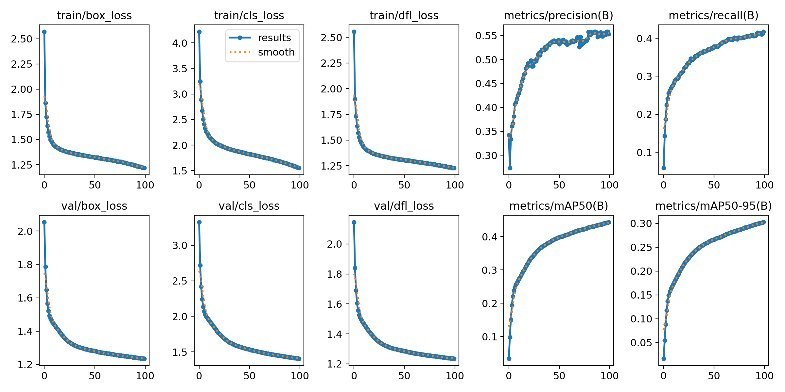
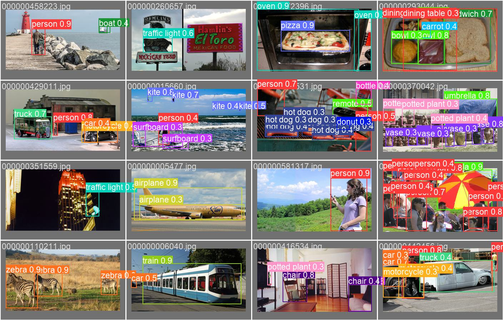
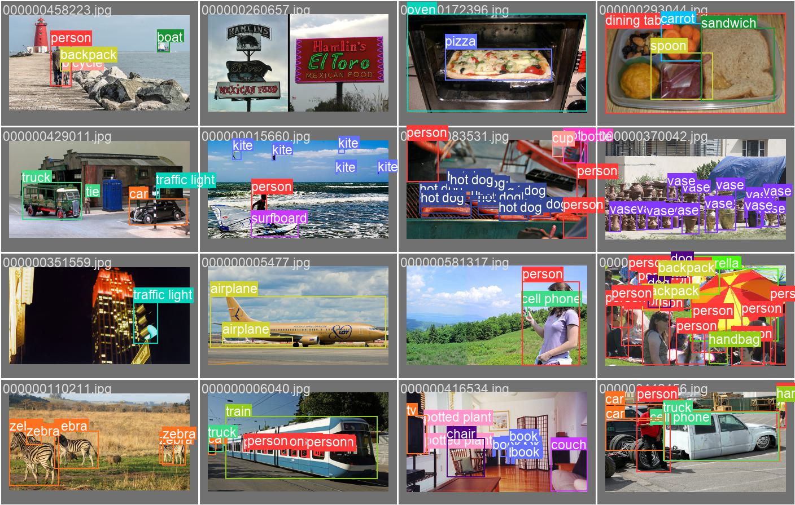
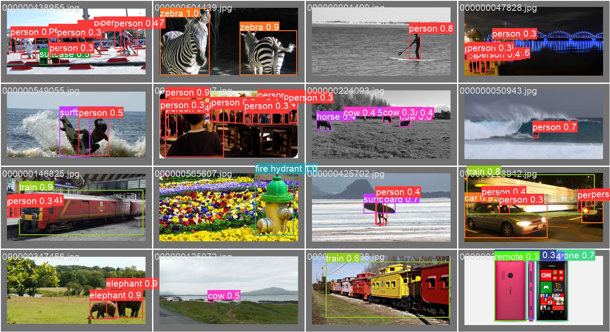
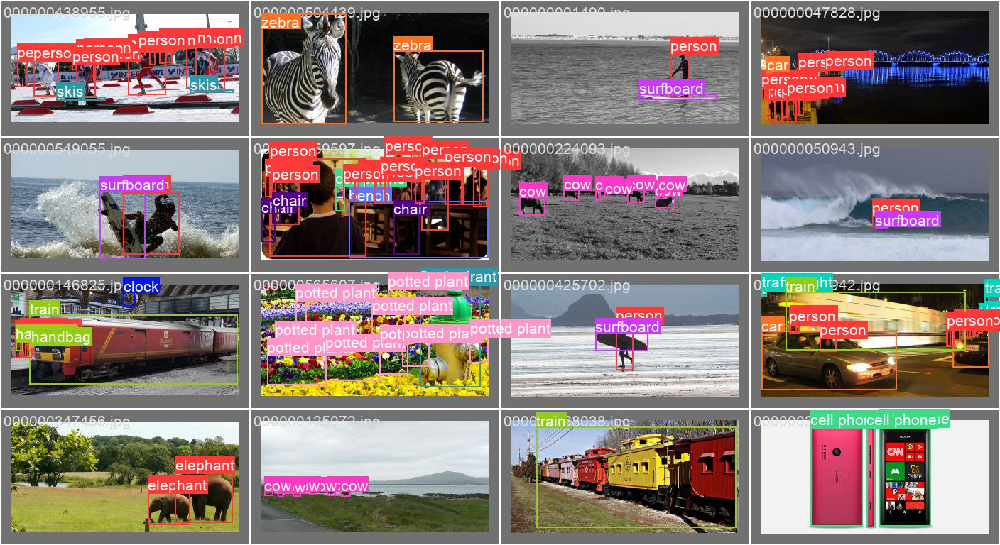

# REPORT week 4

## Important achievements

- analysed the architecture of both the phinet and YOLO in great detail to merge them
- Decision to start from the ultralytics repo and change the backbone and not vicevesa (namely using micromind and changing the head)
- Built phinet backbone into ultralytics' YOLO implementation
- Trained for 100 epochs the new YOLO architecture on the detection COCO dataset

## Architecture of both

--> On paper
--> On goodnotes

## Start from ultralytics

I started from ultralytics since it was easier to implement as there was only a small bit to be changed namely the backbone.  I removed the declaration of the backbone in the YAML file and added them manually in the script where the creation of the model is handled.
The next step would be also to hardcode the head in the code and become fully independent from the YAML file.

**A thing to be noted:** *the input image size of yoloV8 is 640 x 640 pixels but the input size of the new modified model is of 320x320 pixel. This choice has been made to accustom for the channel output sizes that has to match the input channel sizes of the head*

**In the future:** *Now the model can't be customized and the parameters alpha beta and t_0 are fixed so that the output channels are well defined. In the future it might be cool to allow some partial customizability and make the user decide on the input image size, and have the neural network adapt on its own to the input size to match the head requirements*

**Food for thought:** *Maybe a NAS can be performed on the parameters, with the constraints of the output sizes*

## Building the NET

During the last two days of the week, I was able with the help of Francesco and Alberto to build and implement the net. It did train and the first epochs was successfully completed.
The code needed some changes and the code of micromind has also been changed by a very small bit.

**Main problems:** *All in all the main problem was to match the sizes of the two networks and make the right connections between the layers, since the head takes as input from 3 different points of the net at 3 different resolutions. The difficult part was also trying to understand the data structures used in ultralytics and match the data from phinet to make everything run smoothly.*

### Training

The training has been left to run for 2 days for a total of 100 epochs. It did finish and following are the results.

### Results

| Epoch | train/box_loss | train/cls_loss | train/dfl_loss | metrics/precision(B) |
|-------|----------------|----------------|----------------|----------------------|
|    96 |         1.2272 |          1.574 |           1.233 |               0.55198 |
|    97 |         1.2218 |         1.5654 |          1.2299 |               0.55842 |
|    98 |         1.2194 |         1.5588 |          1.2286 |               0.55839 |
|    99 |          1.217 |         1.5517 |          1.2275 |               0.55367 |

Average of train/box_loss: = 1.22135
Minimum train/box_loss: 1.217

Note: despite the numbers being a bit higher than other models, they are quite good.

#### examples of detections

val_batch2_pred.jpg

val_batch2_ground.jpg

val_batch1_pred.jpg

val_batch1_labels.jpg

## Next steps

Next steps:

- longer training inspired by this post: <https://openmmlab.medium.com/dive-into-yolov8-how-does-this-state-of-the-art-model-work-10f18f74bab1> --> started training this morning
- do some more analysis on the results and compare with other algorithms and state of the art models
- include the head in the script
- write a detailed report on how to implement the algorithm
- integrate it into micromind
- implement datafactory
- build code to launch training with custom datasets
- some refactoring
- do with only some objects
- datasets imagenet
- <https://www.tensorflow.org/datasets/catalog/i_naturalist2021>

### Analysis

<https://github.com/open-mmlab/mmyolo/blob/dev/docs/en/model_zoo.md>
-> where does our model positions?
<https://arxiv.org/pdf/2207.02696.pdf> (YOLOv7)
